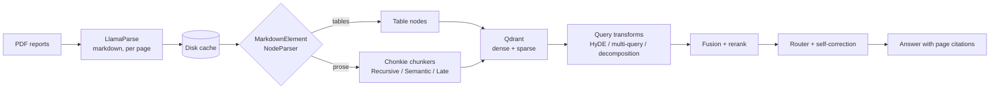

<div align="center">

# 🔍 ReportLens

**A modular, measurable RAG system for Indian annual reports**

*Ask hard questions of 300-page PDFs, then prove which technique actually helped.*


</div>

---

## ✨ What is this?

Annual reports are a great stress test for retrieval: long PDFs, dense financial tables, and natural metadata (company, year, section) to filter on. ReportLens answers questions over reports of Indian listed companies, starting with **Tata Motors (FY24 and FY25)**.

The design rule is simple: **every technique is a swappable module you can switch on or off**, so each one's effect is measured on the same evaluation set. The goal is not just a RAG app but an *ablation table* showing what each idea buys you.

| Question type | Example | Why it is hard |
|---|---|---|
| 🔎 Lookup | "Who is the company's statutory auditor?" | Needle in a haystack |
| 🔢 Table / numeric | "What was consolidated revenue in FY25?" | Numbers live in tables that break naive chunking |
| 📊 Cross-year | "How did free cash flow change from FY24 to FY25?" | Needs documents from two years |
| 🧠 Multi-hop "why" | "Why did margins move?" | Needs several passages stitched together |

---

## 🏗️ Architecture (target)



### Stack

| Area | Choice |
|---|---|
| Parsing | LlamaParse (markdown) + `MarkdownElementNodeParser` |
| Chunking | Chonkie: Recursive, Semantic, Late |
| Vector DB | Qdrant (Docker), hybrid dense + sparse |
| Reranker | Cross-encoder (`bge-reranker-v2-m3`) |
| Orchestration | LlamaIndex Workflows |
| Eval and tracing | RAGAS, Arize Phoenix |
| UI | Chainlit |

---

## 🗺️ Roadmap

- [ ] **CP1: Ingestion and baseline.** Parse, split tables from text, compare three chunkers on hit rate and MRR
- [ ] **CP2: Query transformation.** HyDE, multi-query, step-back, sub-questions, auto-retrieval filters
- [ ] **CP3: Fusion and reranking.** RRF, cross-encoder rerank, small-to-big context
- [ ] **CP4: Router and self-correction.** One entry point that picks its own strategy
- [ ] **CP5: Evaluate, trace, ship.** RAGAS, Phoenix, Chainlit UI, final ablation table

### CP1 progress

| Step | Status |
|---|---|
| Per-page parsing with LlamaParse | ✅ Done |
| On-disk parse cache (no repeat API spend) | ✅ Done |
| Parse Tata Motors FY24 and FY25 | ⏳ Next |
| Eval set (20–30 questions) and matching rule | ⬜ |
| Table / text split | ⬜ |
| Three Chonkie chunkers and adapter | ⬜ |
| Three Qdrant collections | ⬜ |
| Baseline eval: hit rate and MRR | ⬜ |

---

## 🚀 Getting started

**Requirements:** Python 3.13, [`uv`](https://docs.astral.sh/uv/), a [LlamaCloud](https://cloud.llamaindex.ai) API key.

```bash
git clone https://github.com/srimanchaudhuri/ReportLens.git
cd ReportLens
uv sync
```

Create a `.env` in the project root (never commit it):

```env
LLAMA_PARSE_API_KEY=your-key-here
OUT_DIR=parsed_documents
CACHE_DIR=parsed_jobs
```

Parse a document:

```bash
python -m reportlens.app.main
```

Each PDF is parsed once. Pages are saved as JSON (`text` plus `page_number` and `file_name` metadata) under `OUT_DIR/<job_id>/`, and the file-to-job mapping is recorded in `CACHE_DIR/cached_jobs.json`, so reruns make no API calls.

---

## 📁 Project layout

```
src/reportlens/
├── app/            # config (pydantic-settings) and entry point
├── services/rag/   # document_parser.py, document_chunker.py
├── controllers/    # (planned)
├── models/         # (planned)
└── utils/          # (planned)
```

---

## 💡 Design notes

- **Measure everything.** The eval set comes first, so any technique can be judged against a baseline.
- **Parse once.** LlamaParse has page quotas, so output is cached on disk and keyed by file.
- **Fair matching.** Retrieval is scored against gold snippets, not chunk IDs, so differently chunked collections are compared on equal terms.

---

## 📄 License

See [LICENSE](LICENSE).
